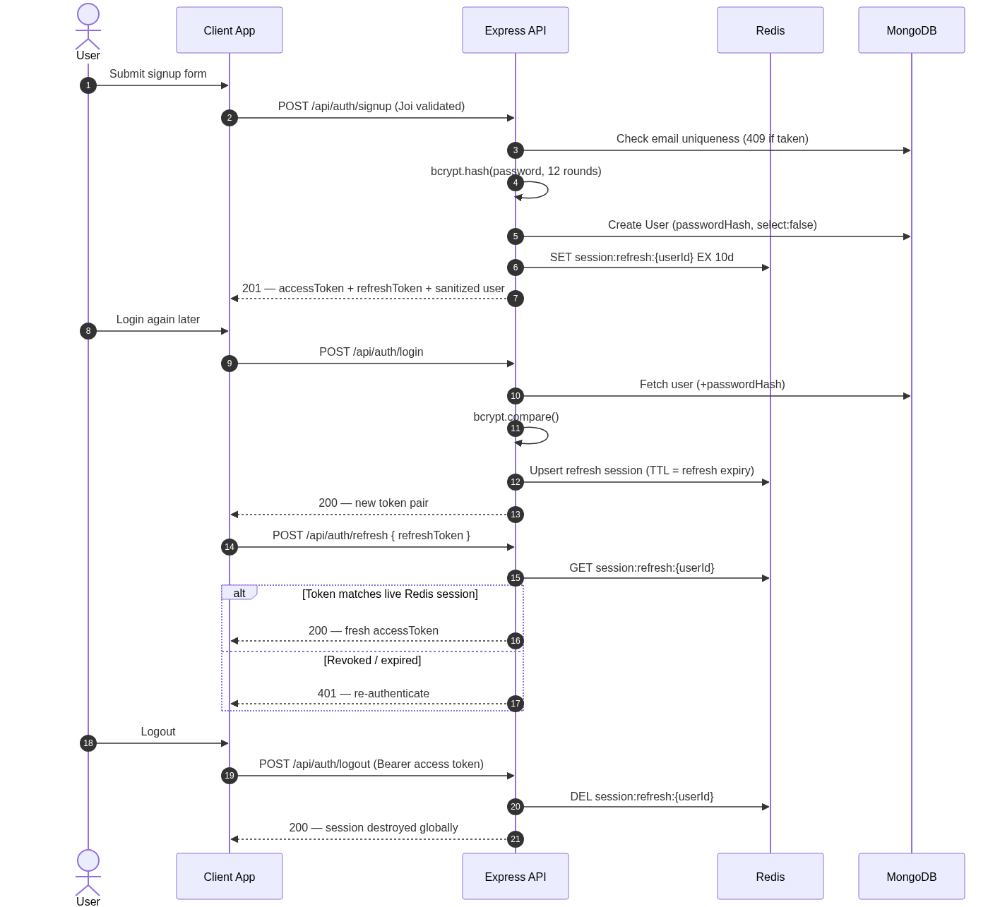
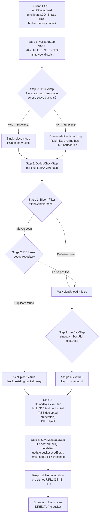
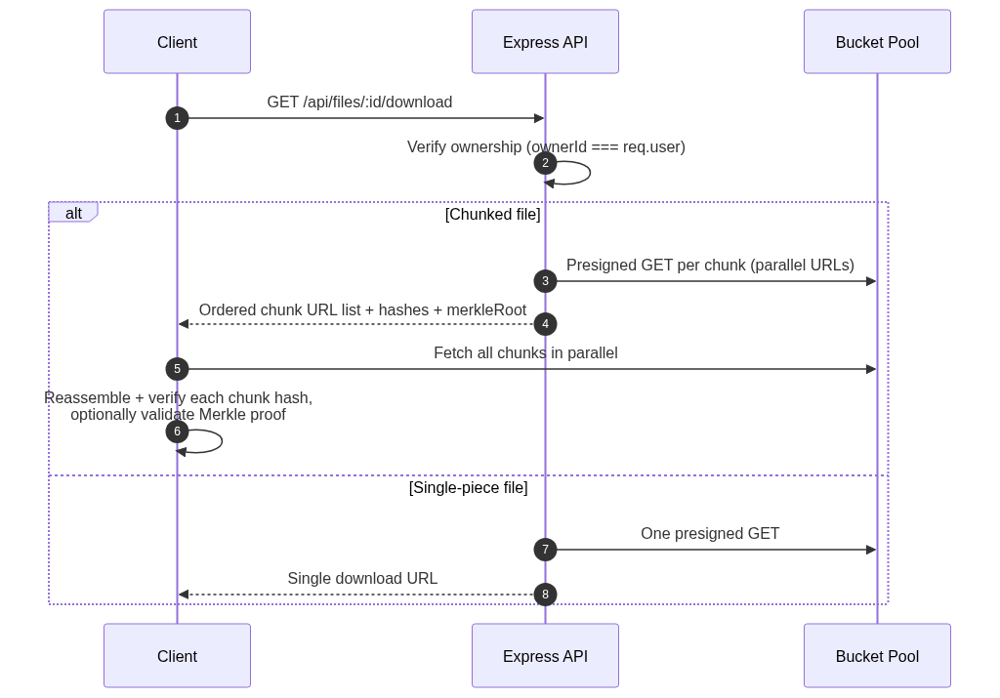
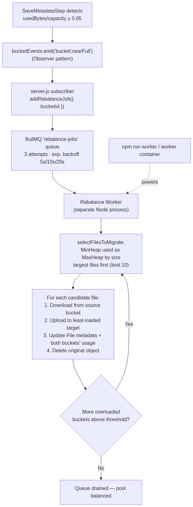

# PoolDrive — Multi-Bucket Virtual Cloud Drive Backend

PoolDrive (repo: `multi-bucket-vault`) is a production-grade cloud storage backend that pools **multiple S3-compatible buckets** (MinIO, Cloudflare R2, Backblaze B2, AWS S3) into one **seamless virtual drive**. Users see unlimited storage; under the hood PoolDrive intelligently distributes files using **consistent hashing**, packs them into buckets with **bin-packing strategies**, eliminates duplicates via a **Bloom filter + SHA-256 two-stage dedup engine**, splits oversized files with **content-defined chunking** (Rabin-Karp rolling hash), verifies integrity with **Merkle trees**, and self-heals capacity with an **automated BullMQ rebalance worker** — all while file bytes flow directly between clients and buckets via **pre-signed URLs**, so the API server only ever touches metadata.

---

## Table of Contents

1. [Key Features](#1-key-features)
2. [Tech Stack](#2-tech-stack)
3. [System Architecture](#3-system-architecture)
4. [Core Workflows](#4-core-workflows)
5. [Algorithms & Design Patterns](#5-algorithms--design-patterns)
6. [Data Layer Overview](#6-data-layer-overview-mongoose-models)
7. [Project Structure](#7-project-structure)
8. [Prerequisites](#8-prerequisites)
9. [Environment Variables](#9-environment-variables)
10. [Installation & Setup](#10-installation--setup)
11. [API Endpoint Overview](#11-api-endpoint-overview)
12. [Security Notes](#12-security-notes)
13. [Deployment Notes](#13-deployment-notes)
14. [Contributing](#14-contributing)
15. [License](#15-license)
16. [Author](#16-author)

---

## 1. Key Features

### 🗄️ Virtual Storage Pool
- **Multi-Provider Buckets**: Register any number of S3-compatible buckets (MinIO, Cloudflare R2, Backblaze B2, AWS S3) at runtime through an admin API — no redeployment required.
- **Unified Adapter Layer**: A single `StorageAdapter` interface abstracts provider differences; one S3-compatible adapter drives all providers.
- **Live Capacity Tracking**: Every bucket tracks `capacityBytes` / `usedBytes` with automatic usage accounting on upload, download, delete, and migrate operations.
- **Bucket Health Monitoring**: Per-bucket health endpoint plus automatic status transitions (`active` → `full` → `offline`).

### 📤 Smart Upload Pipeline (Chain of Responsibility)
- **Step-Based Pipeline**: Every upload flows through six pluggable steps: `Validate → Chunk → Dedup Check → Bin Pack → Upload → Save Metadata`.
- **Content-Defined Chunking**: Files larger than any single bucket's free space are split using Rabin-Karp rolling-hash boundaries instead of naive fixed-size cuts.
- **Two-Stage Deduplication**: In-memory Bloom filter fast-path (≈1% false-positive rate, zero false negatives) backed by a real database lookup — duplicate chunks are never re-uploaded; metadata just links to existing bytes.
- **Direct-to-Bucket Transfers**: Pre-signed PUT URLs let browsers upload straight to buckets; the API never proxies file bytes (JSON body limit kept at 1 MB).

### 🔐 Authentication & Security
- **JWT Access + Refresh Tokens**: Short-lived access tokens (`1d`) with long-lived refresh tokens (`10d`) signed with separate secrets.
- **Server-Side Session Control**: Refresh tokens persisted in Redis with TTL matching token expiry — instant global logout/revocation support.
- **Role-Based Access**: `user` / `admin` roles; all bucket-management routes are admin-only.
- **Request Hardening**: Helmet security headers, NoSQL-injection sanitization, configurable rate limiting (with a stricter dedicated limiter on uploads), and Joi schema validation middleware.

### ⚖️ Self-Healing Storage Operations
- **Observer Event System**: When a bucket crosses the rebalance threshold (default 85% full), a `bucket:nearFull` event fires without coupling storage logic to job logic.
- **BullMQ Background Jobs**: Durable Redis-backed queues with exponential-backoff retries (3 attempts) for rebalancing and scheduled dedup scans.
- **Standalone Rebalance Worker**: A dedicated Node process consumes rebalance jobs — selects the largest files first (min-heap priority queue) and migrates them copy → verify → update-metadata → delete-original.
- **Graceful Shutdown**: SIGTERM/SIGINT handling closes the HTTP server cleanly for zero-downtime container orchestration.

---

## 2. Tech Stack

### Backend
- **Runtime & Framework**: Node.js (ES Modules) + Express.js v5
- **Database & ODM**: MongoDB + Mongoose v9
- **Cache / Queue Broker**: Redis + ioredis v5
- **Background Jobs**: BullMQ v5 (rebalance queue, dedup-scan queue)
- **Authentication & Security**: JWT (`jsonwebtoken`), bcrypt (12 rounds), Helmet, express-rate-limit, express-mongo-sanitize, cookie-parser, CORS
- **Validation**: Joi schema validation middleware
- **File Handling**: Multer (memory storage — buffers are chunked/deduplicated, never written to API disk)
- **Object Storage**: AWS SDK v3 (`@aws-sdk/client-s3` + `@aws-sdk/s3-request-presigner`) against any S3-compatible endpoint
- **Credential Encryption**: AES-256-CBC encryption of bucket secret keys at rest in MongoDB

### DevOps
- **Containerization**: Docker + Docker Compose (MongoDB 7, Redis 7, three MinIO nodes, API service, rebalance worker)

---

## 3. System Architecture

### High-Level Architecture Overview

```
                            ┌────────────────────────────┐
                            │      Client (Browser)      │
                            └──────────┬─────────┬───────┘
                     JSON metadata     │         │  Pre-signed URLs (bytes)
                     (REST + JWT)      │         │  (PUT upload / GET download)
                                       ▼         ▼
┌─────────────────────────────────────────────────────────────────────────────────┐
│                          PoolDrive API Server (Express v5)                      │
│  ┌──────────┬───────────┬──────────┬───────────────┬────────────┬────────────┐  │
│  │  Helmet  │Rate Limit │   CORS   │ MongoSanitize │ Joi Validate│ErrorHandle │  │
│  └──────────┴───────────┴──────────┴───────────────┴────────────┴────────────┘  │
│                                                                                 │
│   auth/    users/    files/    folders/    buckets/        ← feature modules    │
│      │        │         │          │           │                               │
│   Upload Pipeline (Chain of Responsibility)                                     │
│   Validate → Chunk → DedupCheck → BinPack → Upload → SaveMetadata               │
└────────┬─────────────────┬───────────────────┬──────────────────┬──────────────┘
         │                 │                   │                  │
         ▼                 ▼                   ▼                  │ emits
 ┌──────────────┐   ┌─────────────┐   ┌──────────────────┐        │ "bucket:nearFull"
 │   MongoDB    │   │    Redis    │   │  BullMQ Queues   │        ▼
 │ (Mongoose v9)│   │ sessions +  │   │ rebalance-jobs   │   ┌─────────────────┐
 │  users/files │   │ BullMQ conn │   │ dedup-scan-jobs  │   │ Rebalance Worker│
 │  folders/    │   └─────────────┘   └────────┬─────────┘   │ (separate process│
 │  buckets/    │                              │             │  min-heap migr.) │
 │  dedup refs  │                              ▼             └────────┬────────┘
 └──────────────┘                    ┌────────────────────────┐        │
                                     │   Bucket Pool (S3-API) │◄───────┘
                                     │ ┌────────┐ ┌────────┐  │
                                     │ │MinIO 1 │ │MinIO 2 │  │  … also R2 /
                                     │ ├────────┤ ├────────┤  │      B2 / S3
                                     │ │MinIO 3 │ │  ...   │  │
                                     │ └────────┘ └────────┘  │
                                     └───────────▲────────────┘
                                                 │
                                        Client bytes go DIRECTLY
                                        here via pre-signed URLs
```

### Request Pipeline (`app.js`)
Every incoming HTTP request traverses the Express middleware chain in strict order:
1. **Helmet Security Headers**: Applied globally.
2. **CORS Middleware**: Validates origins against `CORS_ORIGIN` with `credentials: true`.
3. **Body Parsers**: `express.json({ limit: "1mb" })` and `express.urlencoded` — intentionally small since file bytes bypass the API entirely via pre-signed URLs.
4. **Cookie Parser**: Reads cookies for session-aware clients.
5. **Mongo Sanitize**: Strips `$` and `.` keys to block NoSQL injection attacks.
6. **Health Check**: Unauthenticated `/health` probe for load balancers and Docker health checks.
7. **Central Route Assembler**: `routes/index.js` mounts exactly five module routers under `/api` (`auth`, `users`, `files`, `folders`, `buckets`) — the only file allowed to touch `app.js` routing.
8. **404 Catch-All + Centralized Error Handler**: Unmatched routes get structured JSON errors; thrown `ApiError` instances translate into clean standardized responses.

### Server Bootstrap Sequence (`server.js`)
1. Import `env.config.js` first (fails fast if any environment variable is missing/invalid).
2. Connect MongoDB, ping Redis.
3. **Seed the Consistent Hash Ring** singleton with every registered bucket.
4. **Register Observer subscribers**: `bucket:nearFull` → enqueue a BullMQ rebalance job.
5. Start HTTP listener; attach SIGTERM/SIGINT graceful shutdown handlers.

---

## 4. Core Workflows

#### 1. Authentication & Session Flow



#### 2. Upload Pipeline — Chunking, Deduplication & Placement



#### 3. Download & Integrity Verification



#### 4. Automated Rebalance (Self-Healing Capacity)



---

## 5. Algorithms & Design Patterns

This project deliberately implements classic systems algorithms from scratch rather than pulling black-box libraries:

| Algorithm | File | Where Used | Why |
|---|---|---|---|
| **Consistent Hashing** (hash ring) | `algorithms/consistentHashing.js` | Seeded at startup with all registered buckets; singleton ring | Adding/removing buckets remaps only ~1/N of keys instead of everything |
| **Bloom Filter** (7 hash fns, ~10M items, ≈1% FPR) | `algorithms/bloomFilter.js` | Stage 1 of dedup check | Rejects definitely-new chunks with zero DB I/O; no false negatives possible |
| **Rabin-Karp Rolling Hash** (content-defined chunking) | `algorithms/rollingHash.js` | Step 2 of upload pipeline | Split points depend on *content*, so inserting bytes early in a file doesn't invalidate all subsequent chunk hashes |
| **Bin Packing** (best-fit / least-used strategies) | `algorithms/binPacking.js` + `bucket/strategies/*` | Step 4 of upload pipeline | Chooses the tightest-fitting bucket (`bestFit`) or spreads load evenly (`leastUsed`) — switchable via `BUCKET_STRATEGY` env |
| **Merkle Tree** (proof generation + verification) | `algorithms/merkleTree.js` | Saved as `merkleRoot` on every chunked file | Tamper-evident integrity: any corrupted/missing chunk breaks the root |
| **Binary Min-Heap** (priority queue) | `algorithms/minHeap.js` | Rebalance file selection | Migrating the *largest* files first frees maximum space with fewest S3 operations |

| Design Pattern | Implementation |
|---|---|
| **Chain of Responsibility** | Six-step upload pipeline wired via `setNext()` — steps mutate a shared context and can short-circuit with errors |
| **Observer (Event Emitter)** | `bucketEvents.emit('bucket:nearFull')` decouples "bucket almost full" detection from "enqueue rebalance" reaction |
| **Strategy** | Pluggable placement strategies behind a common base (`binPackingStrategy.base.js`) |
| **Adapter** | `storageAdapter.base.js` interface + `s3CompatibleAdapter.js` implementation normalizes MinIO/R2/B2/S3 |
| **Factory** | `storageClient.factory.js` builds configured S3Client instances (with decrypted credentials) per bucket |
| **Template Method** | `uploadStep.base.js` defines step contract (`execute(context)`, `setNext()`) |
| **Repository + Service + Controller layering** | Every module strictly separates HTTP handling, business rules, and data access |

---

## 6. Data Layer Overview (Mongoose Models)

- **`User`**: Name, email (unique), `passwordHash` (bcrypt, excluded from queries by default via `select: false`), role (`user` | `admin`), email verification flag.
- **`Bucket`**: Provider enum (`minio` | `r2` | `b2` | `s3`), endpoint, bucket name, region, `accessKeyId`, and `secretAccessKey` — **encrypted at rest with AES-256-CBC** (`iv:ciphertext` hex format) via a `pre("save")` hook and decrypted only inside the storage adapter when building an S3Client. Also stores `capacityBytes`, `usedBytes`, status (`active` | `full` | `offline`), with `freeBytes` / `usageFraction` virtuals.
- **`File`**: Owner, optional folder reference, filename, MIME type, size, content hash. For single-piece uploads: `bucketId` + object `key`. For chunked uploads: ordered `chunks[]` array where each entry records `{ order, bucketId, key, hash, sizeBytes }`, plus a `merkleRoot` for integrity verification and an `isChunked` flag.
- **`Folder`**: Hierarchical folder tree per user; contents listing joins files + subfolders.
- **Dedup Registry** (via `dedup.repository`): Maps chunk SHA-256 hashes to their existing physical location `{ bucketId, key }` — the source of truth consulted when the Bloom filter answers "maybe".

---

## 7. Project Structure

PoolDrive uses strict feature-module architecture — each module owns its routes, controller, service, repository, and model:

```
Backend/
├── docker/
│   ├── Dockerfile                    # Production API image
│   └── docker-compose.yml            # Mongo + Redis + 3× MinIO + api + worker
├── src/
│   ├── server.js                     # Bootstrap: DB → Redis → hash ring → events → listen
│   ├── app.js                        # Express app: middleware chain + route mounting
│   ├── algorithms/                   # Hand-built CS algorithms (no libraries)
│   │   ├── binPacking.js             #   First/best-fit packing solver
│   │   ├── bloomFilter.js            #   Probabilistic membership filter
│   │   ├── consistentHashing.js      #   Hash ring singleton
│   │   ├── merkleTree.js             #   Proof generation & verification
│   │   ├── minHeap.js                #   Generic comparator-based heap
│   │   └── rollingHash.js            #   Rabin-Karp + content-defined chunkBuffer()
│   ├── config/
│   │   ├── env.config.js             # Validated env loader (fails fast)
│   │   ├── db.config.js              # Mongoose connection
│   │   ├── redis.config.js           # Shared ioredis client
│   │   └── storage/
│   │       ├── storageProviders.js   # BucketConfig shape + dev MinIO seeds
│   │       └── storageClient.factory.js  # S3Client factory per provider
│   ├── events/
│   │   └── bucketEvents.js           # Observer emitter ('bucket:nearFull')
│   ├── middlewares/
│   │   ├── auth.middleware.js        # JWT bearer verification
│   │   ├── error.middleware.js       # Centralized ApiError handler
│   │   ├── rateLimit.middleware.js   # Configurable window/max limiter
│   │   └── validate.middleware.js    # Joi schema validation wrapper
│   ├── queues/
│   │   ├── queue.config.js           # BullMQ queues (rebalance, dedup-scan)
│   │   └── jobs/
│   │       ├── rebalance.job.js      # Producer: enqueue migrations
│   │       └── dedupScan.job.js      # Scheduled full-pool dedup sweep
│   ├── routes/
│   │   └── index.js                  # Central assembler — mounts all 5 routers
│   └── modules/
│       ├── auth/                     # signup, login, refresh, logout
│       ├── user/                     # profile (/me) management
│       ├── file/                     # upload/list/download/delete
│       │   └── pipeline/             # 6-step Chain of Responsibility
│       │       ├── validateStep.js   #   size/mimetype checks
│       │       ├── chunkStep.js      #   conditional content-defined split
│       │       ├── dedupCheckStep.js #   bloom + DB two-stage dedup
│       │       ├── binPackStep.js    #   strategy-based bucket selection
│       │       ├── uploadToBucketStep.js # presigned PUT / direct upload
│       │       ├── saveMetadataStep.js   # File doc + usage accounting
│       │       └── uploadStep.base.js    # template-method base class
│       ├── folder/                   # nested folder tree CRUD
│       ├── bucket/                   # admin bucket registry
│       │   ├── adapters/             #   storageAdapter.base + s3CompatibleAdapter
│       │   └── strategies/           #   bestFitStrategy, leastUsedStrategy
│       ├── dedup/                    # bloom fast-path + registry lookups
│       └── rebalance/                # service (heap selection + migrate) + worker
├── .env.example
└── package.json
```

---

## 8. Prerequisites

Before installing, ensure you have the following installed on your machine:
- **Node.js**: `v18.x` or higher
- **npm**: a recent version matching your Node install
- **MongoDB**: Local instance (`mongodb://localhost:27017`) or a MongoDB Atlas URI
- **Redis**: Local instance or hosted (required for sessions + BullMQ)
- **At least one S3-compatible bucket**: Local MinIO (spun up automatically via Docker Compose) or a Cloudflare R2 / Backblaze B2 / AWS S3 account
- **Docker & Docker Compose** *(optional, for one-command infrastructure)*

---

## 9. Environment Variables

Create a `.env` file inside the `Backend/` directory based on `Backend/.env.example`:

| Environment Variable | Description |
|---|---|
| `PORT` | Port the API server listens on (default: `8000`). |
| `NODE_ENV` | Application environment (`development`, `production`). |
| `MONGO_URI` | MongoDB connection URI (`mongodb://localhost:27017` or Atlas SRV string). |
| `REDIS_URL` | Redis connection URI (`redis://localhost:6379`). |
| `JWT_SECRET` | Secret used to sign JWT **access tokens** (use `openssl rand -hex 64`). |
| `ACCESS_TOKEN_EXPIRY` | Access token lifetime (default: `1d`). |
| `REFRESH_TOKEN_SECRET` | Separate secret for **refresh tokens**. |
| `REFRESH_TOKEN_EXPIRY` | Refresh token lifetime (default: `10d`). |
| `ENCRYPTION_KEY` | **Exactly 32 characters** — AES-256-CBC key encrypting bucket secrets at rest. |
| `BUCKET_STRATEGY` | Placement strategy: `bestFit` or `leastUsed`. |
| `MAX_FILE_SIZE_BYTES` | Upload ceiling in bytes (default: `104857600` = 100 MB). |
| `CHUNK_SIZE_BYTES` | Target chunk size when splitting (default: `5242880` = 5 MB). |
| `PRESIGNED_URL_EXPIRY_SECONDS` | Lifetime of pre-signed upload/download URLs (default: `900` = 15 min). |
| `RATE_LIMIT_WINDOW_MS` | Rate-limit sliding window (default: `60000` = 1 min). |
| `RATE_LIMIT_MAX_REQUESTS` | Max requests per window (default: `100`). |
| `REBALANCE_THRESHOLD` | Usage fraction (0.0–1.0) triggering `bucket:nearFull` (default: `0.85`). |
| `CORS_ORIGIN` | Allowed browser origin (e.g. `http://localhost:5173`). |
| `FRONTEND_URL` | Frontend base URL for links/CORS. |
| `EMAIL_USER` | *(Optional)* SMTP sender for account verification features. |
| `EMAIL_PASS` | *(Optional)* SMTP app password. |

---

## 10. Installation & Setup

### Option A: Full Stack via Docker Compose (Recommended)

The bundled compose file provisions the entire infrastructure pool — MongoDB, Redis, and **three independent MinIO buckets** — plus the API server and rebalance worker:

```bash
cd Backend
cp .env.example .env
# Edit .env — set JWT secrets, ENCRYPTION_KEY (32 chars), etc.
docker compose -f docker/docker-compose.yml up --build
```

| Service | Endpoint |
|---|---|
| PoolDrive API | `http://localhost:8000` |
| MinIO Bucket 1 — Console / S3 API | `http://localhost:9101` / `localhost:9001` |
| MinIO Bucket 2 — Console / S3 API | `http://localhost:9102` / `localhost:9002` |
| MinIO Bucket 3 — Console / S3 API | `http://localhost:9103` / `localhost:9003` |
| MongoDB | `localhost:27017` |
| Redis | `localhost:6379` |

Default MinIO credentials (development only): `minioadmin` / `minioadmin123`.

The **worker container** runs `src/modules/rebalance/rebalance.worker.js` as a separate process, consuming jobs from the shared Redis-backed BullMQ queues.

### Option B: Local Development (Node only)

```bash
cd Backend
npm install
cp .env.example .env
# Point MONGO_URI / REDIS_URL at your local services

npm run dev        # API server with nodemon hot-reload (port 8000)
npm run worker     # Rebalance worker in a second terminal
```

### First Run: Register Your Buckets

1. Log in and promote your user to `admin` directly in MongoDB:
   ```js
   db.users.updateOne({ email: "you@example.com" }, { $set: { role: "admin" } })
   ```
2. Register each bucket in the pool (admin-only):
   ```bash
   curl -X POST http://localhost:8000/api/buckets \
     -H "Authorization: Bearer <ADMIN_ACCESS_TOKEN>" \
     -H "Content-Type: application/json" \
     -d '{
       "provider": "minio",
       "endpoint": "http://localhost:9001",
       "bucketName": "pool-bucket-1",
       "region": "us-east-1",
       "accessKeyId": "minioadmin",
       "secretAccessKey": "minioadmin123",
       "capacityBytes": 10737418240
     }'
   ```
3. Repeat for ports `9002` / `9003`. New buckets join the consistent hash ring **live** — no restart needed.

---

## 11. API Endpoint Overview

All API routes are mounted under the `/api` base path in `app.js`:

| Route Prefix | Module / Purpose | Key Operations |
|---|---|---|
| `/api/auth` | Authentication | Signup (Joi-validated), login, refresh (token rotation against Redis session store), logout (revokes refresh session globally). |
| `/api/users` | Profile Management | Get current user (`GET /me`), update profile (`PATCH /me`). |
| `/api/files` | File Operations | Multipart upload via pipeline (rate-limited to 20/min), list by folder, generate parallel pre-signed download URLs, delete (removes objects + reverses bucket usage). |
| `/api/folders` | Folder Tree | Create nested folders, list folder contents, recursive delete. |
| `/api/buckets` | Admin: Storage Pool | Register new S3-compatible bucket (credentials AES-encrypted on save), list pooled buckets, per-bucket health check. |
| `/health` | Ops Probe | Unauthenticated liveness check for load balancers/Docker. |

---

## 12. Security Notes

- **Encrypted Bucket Credentials**: Provider secret keys are AES-256-CBC encrypted before hitting MongoDB (`iv:ciphertext`); plaintext exists only in memory inside the adapter while building S3Clients.
- **Password Storage**: bcrypt hashing at 12 salt rounds; hashes excluded from all queries unless explicitly selected.
- **Refresh-Token Revocation**: Sessions live in Redis keyed by user with TTL — logout or compromise response instantly invalidates old refresh tokens everywhere.
- **NoSQL Injection Defense**: `express-mongo-sanitize` strips operator keys (`$`, `.`) from bodies, queries, and params.
- **Rate Limiting**: Global configurable limiter plus a hardened 20-uploads-per-minute rule on the file pipeline.
- **Input Validation**: Every mutating route passes through Joi schema validation middleware before controllers execute.
- **Least-Exposure API**: The server holds no file bytes — pre-signed URLs (short TTL) authorize direct client↔bucket traffic, shrinking the attack surface.
- **Security Headers**: Helmet sets CSP, frameguard, and XSS-protection headers globally.

---

## 13. Deployment Notes

- **Horizontal Scaling**: The API is stateless (sessions in Redis, metadata in MongoDB) — scale API containers independently of the rebalance worker.
- **Production Checklist**:
  1. Set `NODE_ENV=production` and strong values for `JWT_SECRET`, `REFRESH_TOKEN_SECRET`, and a random 32-char `ENCRYPTION_KEY` (rotating this key invalidates stored bucket credentials).
  2. Provision managed MongoDB + Redis; register production R2/B2/S3 buckets via the admin API.
  3. Tune `REBALANCE_THRESHOLD` and rate limits for expected load.
  4. Deploy the worker (`npm run worker`) alongside the API so rebalance jobs drain continuously.
- **Zero-Downtime Restarts**: SIGTERM-triggered graceful shutdown drains in-flight requests before exit — safe under Kubernetes/Docker orchestrators.

---

## 14. Contributing

1. **Fork the Repository**
2. **Create a Feature Branch**: `git checkout -b feature/amazing-feature`
3. **Commit your Changes**: `git commit -m 'feat: add some amazing feature'`
4. **Push to the Branch**: `git push origin feature/amazing-feature`
5. **Open a Pull Request**

> Development follows trunk-based flow through `develop`: feature branches merge into `develop`, and `develop` merges into `main` for releases.

---

## 15. License

Distributed under the **ISC License**. See package manifest for details.

---

## 16. Author

Created and maintained by **Vedant** ([@Vedant07022006](https://github.com/Vedant07022006)).
